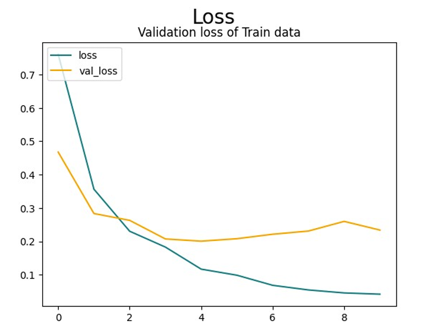

# Brain Tumor Classification Using Convolutional Neural Networks (CNNs)

## Introduction
Brain tumors are abnormal growths of cells in the brain, and their early diagnosis is essential for effective treatment. Traditional diagnostic methods rely on radiologists, which can be time-consuming and subjective. Deep learning, particularly CNNs, has shown remarkable progress in medical image classification. This project aims to develop a CNN-based classifier to automatically distinguish between different types of brain tumors.

## Dataset and Preprocessing
### Dataset Description
The dataset used in this study was obtained from Kaggle. It consists of labeled MRI images categorized into different tumor types.

### Preprocessing Steps
The preprocessing pipeline includes:
- Extracting images from a compressed dataset.
- Normalizing pixel values to scale between 0 and 1.
- Data augmentation techniques such as rotation, flipping, and zooming to improve model generalization.
- Splitting the dataset into training and testing subsets.
- Converting labels into numerical format.

## Model Architecture
The CNN model consists of multiple convolutional layers followed by pooling layers and fully connected layers. The architecture is as follows:
- Convolutional layers with ReLU activation.
- Max-pooling layers to reduce dimensionality.
- Fully connected layers with dropout regularization.
- Softmax output layer for classification.

## Training and Evaluation
The model was compiled using categorical cross-entropy as the loss function and Adam optimizer. The training involved:
- **Batch size**: 32
- **Number of epochs**: 25
- **Learning rate**: 0.001

The performance was evaluated using accuracy and loss metrics.

## Results and Discussion
The training and validation loss plots indicate a steady decrease in training loss, demonstrating effective learning. However, validation loss fluctuates, suggesting potential overfitting.

The model achieved an accuracy of approximately **90%**, indicating its ability to generalize well on unseen data. However, further fine-tuning and hyperparameter optimization can improve performance.

## Conclusion and Future Work
This study successfully implemented a CNN-based model for brain tumor classification. Future improvements may include:
- Using more advanced architectures like ResNet or EfficientNet.
- Applying transfer learning to leverage pre-trained models.
- Experimenting with different preprocessing techniques for better feature extraction.

## References
- LeCun, Y., Bottou, L., Bengio, Y., Haffner, P. (1998). Gradient-based learning applied to document recognition.
- Krizhevsky, A., Sutskever, I., Hinton, G. E. (2012). ImageNet classification with deep convolutional neural networks.
- He, K., Zhang, X., Ren, S., Sun, J. (2016). Deep residual learning for image recognition.

---
This project provides a foundational approach to brain tumor classification using deep learning. Contributions and improvements are welcome!
